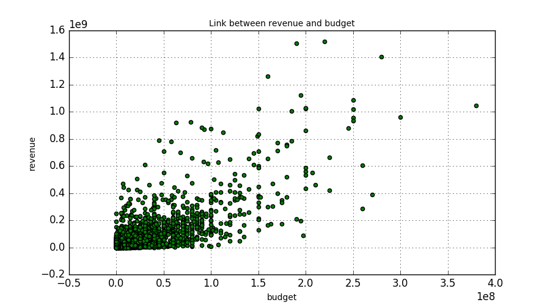
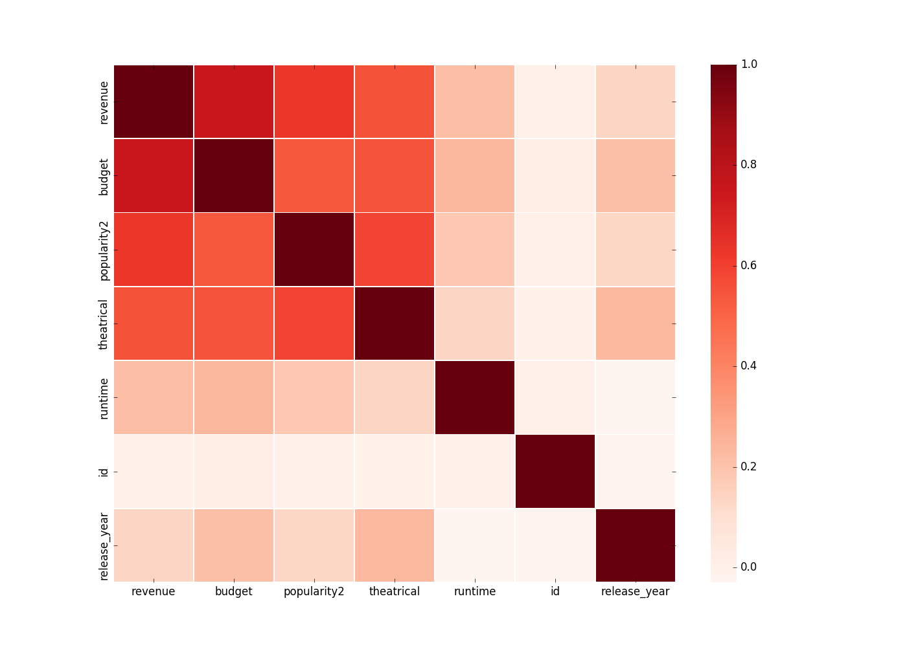
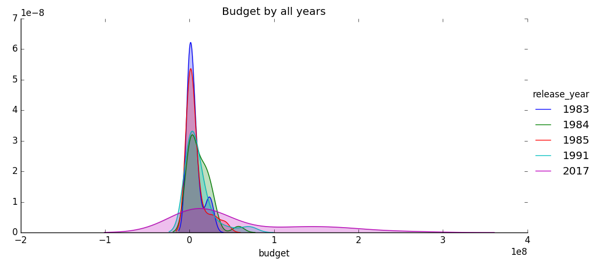

# 电影数据分析
> 刘家硕 计63 2016011286


## 一、实验概述

### 1. 实验目标
本项目希望基于电影数据集，依据电影的简介、关键词、预算、票房、用户评分等特征来对电影进行分析，并完成以下任务：

* 对电影特征的可视化分析
* 对电影票房的预测
* 多功能个性化的电影推荐算法

### 2. 数据集
* 针对票房预测部分，本项目使用了收集自<a href= 'https://www.themoviedb.org/'> The Movie Database(TMDB)</a>数据集的7398条电影信息, 包含了id、预算、电影主页、票房、语言、时长、评分、受欢迎度等特征，全部数据可见于<a href='https://www.kaggle.com/c/tmdb-box-office-prediction/data'>Kaggle TMDB Box Office Prediction</a>中。
* 针对电影推荐部分，本项目使用了收集自<a href= 'https://www.themoviedb.org/'> The Movie Database(TMDB)</a>数据集的TMDB5000数据集以及收集自电影数据集<a href='http://files.grouplens.org/datasets/movielens/ml-latest-small.zip'>MovieLens</a>的部分数据，包含了id、预算、内容简介、关键词等特征，并且包含了用户对电影的评分矩阵，全部数据可见于<a href='https://github.com/LJSthu/Movie-Analysis/tree/master/data'>LJSthu(github)</a>中。

### 3. 实验完成情况
* 完成了对电影特征的可视化分析。
* 完成了基于电影特征的电影票房预测算法，并在Kaggle的TMDB Box Office Prediction比赛中最终取得了前 6.8%（95/1400）的成绩。
* 完成了基于简单特征（内容、评分、关键词）的三种推荐算法、基于KNN的两种协同过滤算法、基于奇异值分解的推荐算法以及三种集成推荐算法，共设计并实现了九种电影推荐算法。


## 二、电影特征的可视化分析
本项目中，我首先对电影数据的一些特征进行了可视化分析，来为之后的票房预测和电影推荐做帮助。

* 首先我分别绘制了票房与预算、欢迎程度（popularity）、戏剧性程度（theatrical）的关系图，如下图所示：



* 从图中可以看出，这三个特征与票房之间存在着比较强的相关关系，于是我选取了票房、预算、受欢迎程度、戏剧性、放映时间、id、上映年份7个特征，绘制了它们之间的相关关系图，如下图所示：


* 图中颜色越深代表相关关系越强，可以看出电影票房与预算、受欢迎程度、戏剧性三个特征有着很强的相关关系，而与上映时间、id等信息几乎没有相关关系，这也十分符合我们的预期。
* 我还研究了电影语言与票房的关系，如下图所示：


* 最后我探究了电影预算与电影上映年份之间的关系，为了突出区别，我选取了1983、1984、1985、1991、2017五个年份的电影预算来进行密度估计，结果如图所示：


* 从图中可以看出上映年份对预算的分布影响比较大，较早的年份预算集中于比较低的部分，而越靠近现在，电影的预算分布相对越均匀，对应着越来越多的大制作电影，这里我认为上映年份这个特征对票房的影响主要是通过对预算的影响来体现的。
* 备注：这部分代码参见<a href='https://github.com/LJSthu/Movie-Analysis/tree/master/FeatureEDA'> LJSthu(github)</a>


## 三、电影票房预测


## 四、电影推荐算法
这里将分别介绍我实现的九种电影推荐算法。

### 1. 基于人口统计学的推荐
* 这里我实现了一个基于评分的推荐算法,对每部电影计算评分如下：
$$score = \frac{v}{v+m}*r + \frac{m}{m+v}*c$$
其中$v$为当前电影的投票数目，$m$为所有电影的平均投票数目，$r$为当前电影的平均等级，$c$为所有电影的平均等级
* 算法为用户推荐评分最高的10部电影。

```
结果示例：
title       									score
The Shawshank Redemption          				8.059258
Fight Club          							7.939256
The Dark Knight         						7.920020
Pulp Fiction          							7.904645
Inception         								7.863239
The Godfather          							7.851236
Interstellar         							7.809479
Forrest Gump         							7.803188
The Lord of the Rings: The Return of the King   7.727243
The Empire Strikes Back          				7.697884

```


### 2. 基于内容的推荐算法
* 这里我实现了两种简单的推荐算法，相关代码参见<a href='https://github.com/LJSthu/Movie-Analysis/tree/master/naive_recommender'> LJSthu(github)</a>

#### （1）基于电影简介文本的推荐算法
* 首先将电影数据中的简介文本通过sklearn中的`TfidfVectorizer`,将简介文本变成向量，并使用`cosine`距离来度量向量之间的相似度。
* 用户输入一个电影名字，算法推荐与之最相近的10部电影。

 ```
 结果示例：
 - 输入： The Dark Knight Rises
 - 输出： The Dark Knight					
			Batman Forever
			Batman Returns
			Batman
			Batman: The Dark Knight Returns, Part 2
			Batman Begins
			Slow Burn
			Batman v Superman: Dawn of Justice
			JFK
			Batman & Robin

 
 ```
* 从结果可以看出，推荐的电影内容与输入电影十分相近，符合算法设计的初衷。 

#### （2）基于电影内容的推荐算法
* 这里我利用了电影中的关键词、类型、导演、演员等信息
* 首先使用sklearn中的`CountVectorizer`将文本转换为词频矩阵，之后利用`cosine`距离来度量电影之间的相似度，与（1）算法很类似。
* 用户输入一个电影名字，算法推荐与之最相近的10部电影。
 
 ```
 结果示例：
 - 输入： The Dark Knight Rises
 - 输出： The Dark Knight
			Batman Begins
			Amidst the Devil's Wings
			The Prestige
			Romeo Is Bleeding
			Black November
			Takers
			Faster
			Catwoman
			Gangster Squad


 
 ```

### 3. 基于KNN的协同过滤算法
* 这里我实现了两种基于KNN的协同过滤算法，代码可见<a href=''>


### 4. 基于奇异值分解的推荐算法


### 5. 集成推荐算法
