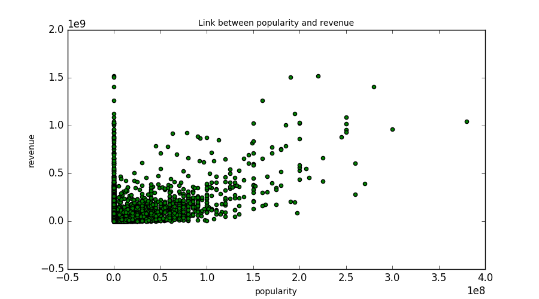
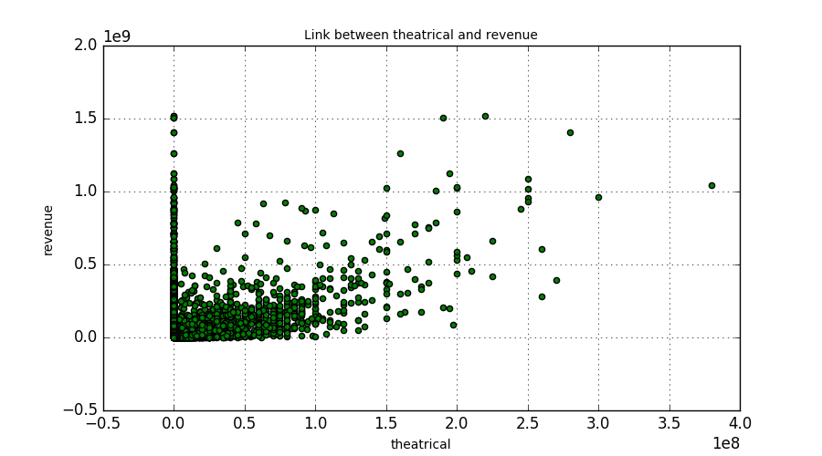
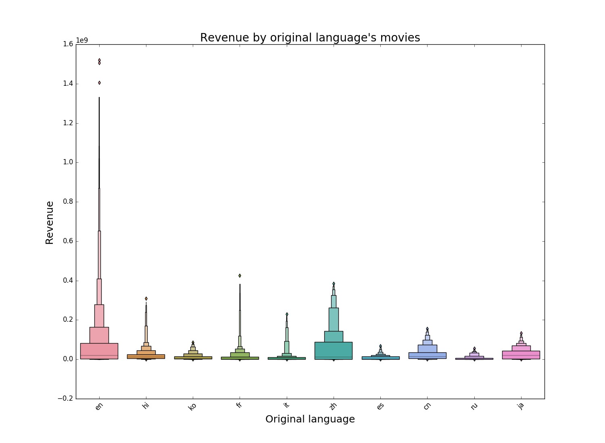

# 电影数据分析
> 刘家硕 计63 2016011286

## 一、实验概述

### 1. 实验目标
本项目希望基于电影数据集，依据电影的简介、关键词、预算、票房、用户评分等特征来对电影进行分析，并完成以下任务：

* 对电影特征的可视化分析
* 对电影票房的预测
* 多功能个性化的电影推荐算法

### 2. 数据集
* 针对票房预测部分，本项目使用了收集自<a href= 'https://www.themoviedb.org/'> The Movie Database(TMDB)</a>数据集的7398条电影信息, 包含了id、预算、电影主页、票房、语言、时长、评分、受欢迎度等特征，全部数据可见于<a href='https://www.kaggle.com/c/tmdb-box-office-prediction/data'>Kaggle TMDB Box Office Prediction</a>中。
* 针对电影推荐部分，本项目使用了收集自<a href= 'https://www.themoviedb.org/'> The Movie Database(TMDB)</a>数据集的TMDB5000数据集以及收集自电影数据集<a href='http://files.grouplens.org/datasets/movielens/ml-latest-small.zip'>MovieLens</a>的部分数据，包含了id、预算、内容简介、关键词等特征，并且包含了用户对电影的评分矩阵，全部数据可见于<a href='https://github.com/LJSthu/Movie-Analysis/tree/master/data'>LJSthu(github)</a>中。

### 3. 实验完成情况
* 完成了对电影特征的可视化分析。
* 完成了基于电影特征的电影票房预测算法，并在Kaggle的TMDB Box Office Prediction比赛中最终取得了前 6.8%（95/1400）的成绩。
* 完成了基于简单特征（内容、评分、关键词）的三种推荐算法、基于KNN的两种协同过滤算法、基于奇异值分解的推荐算法以及三种集成推荐算法，共设计并实现了九种电影推荐算法。

## 二、电影特征的可视化分析
本项目中，我首先对电影数据的一些特征进行了可视化分析，来为之后的票房预测和电影推荐做帮助。

* 首先我分别绘制了票房与预算、欢迎程度（popularity）、戏剧性程度（theatrical）的关系图，如下图所示：

* 从图中可以看出，这三个特征与票房之间存在着比较强的相关关系，于是我选取了票房、预算、受欢迎程度、戏剧性、放映时间、id、上映年份7个特征，绘制了它们之间的相关关系图，如下图所示：

* 图中颜色越深代表相关关系越强，可以看出电影票房与预算、受欢迎程度、戏剧性三个特征有着很强的相关关系，而与上映时间、id等信息几乎没有相关关系，这也十分符合我们的预期。
* 我还研究了电影语言与票房的关系，如下图所示：

* 最后我探究了电影预算与电影上映年份之间的关系，为了突出区别，我选取了1983、1984、1985、1991、2017五个年份的电影预算来进行密度估计，结果如图所示：

* 从图中可以看出上映年份对预算的分布影响比较大，较早的年份预算集中于比较低的部分，而越靠近现在，电影的预算分布相对越均匀，对应着越来越多的大制作电影，这里我认为上映年份这个特征对票房的影响主要是通过对预算的影响来体现的。
* 备注：这部分代码参见<a href='https://github.com/LJSthu/Movie-Analysis/tree/master/FeatureEDA'> LJSthu(github)</a>

## 三、电影票房预测

## 四、电影推荐算法
这里将分别介绍我实现的九种电影推荐算法。

### 1. 基于内容的推荐算法
* 这里我实现了三种简单的推荐算法，相关代码参见<a href=''> 
